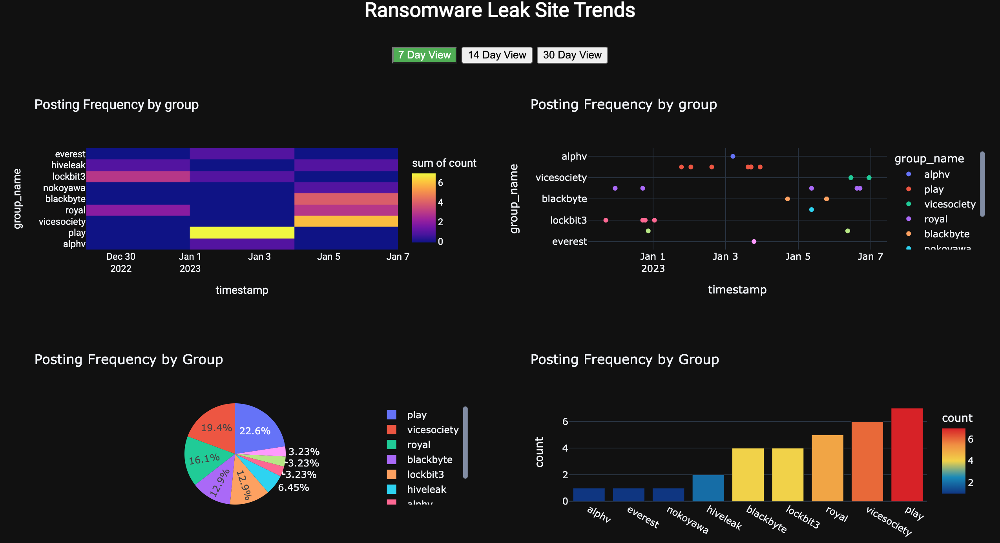

# Leak Site Analytics

This repository contains a collection of scripts that use Plotly to perform data visualization of ransomware leak site postings.

## Acknowledgments
The raw data used is provided by [RansomWatch](https://ransomwatch.telemetry.ltd).

OpenAI's [OpenAI's ChatGPT](https://chat.openai.com/chat) was involved the production of these scripts.

### Further Reading about ChatGPT's usage

The following blog post contains information on how ChatGPT was used in this project:
- [blog](https://www.th3protocol.com/2022/ChatGPT-LeakSite-Analysis)

## Usage

#### Prerequisites 
Plotly is required and can be installed via PyPi. `python3 -m pip install plotly`

### All-In-One Dashboard

The script [run_all.py](https://github.com/colincowie/LeakSiteAnalytics/blob/master/run_all.py) performs the following actions:
1. Downloads the most recent data from RansomWatch
2. Creates multiple plotly .html files for a Pie Chart, Scatter Graph, Bar Chart and Density Heatmap.
3. The file [dashboard.html](https://github.com/colincowie/LeakSiteAnalytics/blob/master/dashboard.html) can be used to view all of these .html files in a single view (shown in the screenshot)

### Other Options
The following standalone scripts can be leveraged to create a single data visualizations format:
- [Bar Graph](https://github.com/colincowie/LeakSiteAnalytics/blob/master/visualizations/bar_graph.py)
- [Heatmap](https://github.com/colincowie/LeakSiteAnalytics/blob/master/visualizations/heatmap.py)
- [Scatter Graph](https://github.com/colincowie/LeakSiteAnalytics/blob/master/visualizations/scatter_graph.py)

> Note: `posts.json` must be placed into the `LeakSiteAnalytics` folder for these scripts to work.
> The most recent leak site data from RansomWatch can downloaded for their repository:
> - [https://github.com/joshhighet/ransomwatch/blob/main/posts.json](https://github.com/joshhighet/ransomwatch/blob/main/posts.json)

